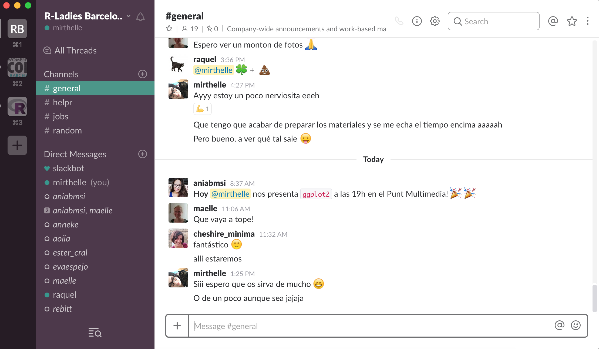
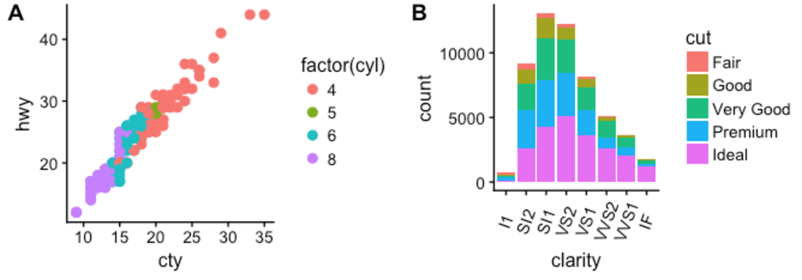

# About R-Ladies

```{r globat_settings}
  knitr::opts_chunk$set(cache = TRUE,
                        fig.align="center",
                        echo=TRUE)
```


## What is R-Ladies?
Worldwide organization that promotes **gender diversity** in the R community via meetups and mentorship in a **friendly and safe environment**.

```{r, echo=FALSE, fig.align="center"}
knitr::include_graphics("images/R-LadiesGlobal_RBG_online_LogoWithText.png", dpi=300)
```

## R-Ladies Barcelona
- Created in November 2016 by **Maëlle Salmon** and **Rebeca Huerga**.
- **Season 2016-2017**: 8 Meetups and more than 250 R-Ladies!

```{r, echo=FALSE}
knitr::include_graphics("images/maelle_and_rebeca.png", dpi=150)
```


## R-Ladies Barcelona v.2
- Change of organizers summer 2017: **Ania Alay** and **Mireia Ramos**

```{r, echo=FALSE}
knitr::include_graphics("images/ania_and_mireia.png", dpi=150)
```


More to come in this season **2017-2018**!

```{r, echo=FALSE, fig.align="center"}
knitr::include_graphics("https://media.giphy.com/media/nsMPhWK6bfxHq/giphy.gif")
```

## Join us at Slack!

```{r, echo=FALSE}

```


# Introduction
## Who am I?
- PhD student in **Biomedicine and Bioinformatics**. I analyze **genomic and epigenomic data using R** to increase knowledge in the pathological bases of Type 1 Diabetes.
- I have two cats whom I love. `#rcatladies`
- I enjoy watching lots of TV series and playing videogames.

```{r, echo=FALSE, out.height=300, out.width=300}
knitr::include_graphics("images/mycats.png")
```


## Why ggplot2?
`ggplot2` is a data visualization package for R developed by [Hadley Wickham](https://twitter.com/hadleywickham) that provides a structured approach to graphing.

**Pros**:

- Standardized method for plotting.
- Easy to create publication quality plot.
- Allows creation of relatively complex plots with ease.
- Most dominant statistics plotting package in R.

```{r, echo=FALSE, fig.align="center", out.width=200}
knitr::include_graphics("https://media.giphy.com/media/QDRJ6IJzFSR1K/giphy.gif")
```


## Why ggplot2?
**Cons**:

- Might be a little bit difficult to understand at the beginning. 
- Some times you might get lost between all the things you can change.

```{r, echo=FALSE, fig.align="center"}
knitr::include_graphics("https://media.giphy.com/media/2FazgxLhFpYv4t93G/giphy.gif")
```


## Why ggplot2?

But in the end it's worth it!

```{r, echo=FALSE, fig.align="center"}
knitr::include_graphics("https://media.giphy.com/media/POKjtSbQ1z4Mo/giphy.gif")
```


# Basics of ggplot2

## Basic elements
We find 4 basic elements in a `ggplot2` plot:

- **Data**. The data you want to show in the plot.
- **Geometries** or **`geom_`**. Sets the type of graphic and elements that you want to plot. 
- **Aesthetics** or **`aes()`**. Maps a variable to an element in the plot (x and y axes, color, size, shape, etc.)
- **Scales** or **`scale_`**. Allows you to select range of values to plot or map specific colors to factors.

## Advanced elements^[Extracted from [“A Simple Introduction to the Graphing Philosophy of ggplot2”](https://tomhopper.me/2014/03/28/a-simple-introduction-to-the-graphing-philosophy-of-ggplot2/) by Tom Hopper]

- **Statistical transformations** or **`stat_`**. Statistical summaries of the data that can be plotted, such as quantiles, fitted curves (loess, linear models, etc.), sums and so on.
- **Coordinate systems** or	**`coord_`**.	The transformation used for mapping data coordinates into the plane of the data rectangle.
- **Facets** or **`facet_`**. The arrangement of the data into a grid of plots (also known as latticing, trellising or creating small multiples).
- **Visual Themes** or **`theme`**.	The overall visual defaults of a plot: background, grids, axe, default typeface, sizes, colors, etc.

## Steps for plotting

1. Convert your `data.frame` to long format (not always needed!).
2. Use `ggplot()` with your data and map your x and y values.
3. Add geoms that you want to show and map other aesthetical parameters.

```{r, echo=FALSE, fig.align="center"}
knitr::include_graphics("https://media.giphy.com/media/iqRgU7mFDGeUU/giphy.gif")
```


## Steps for plotting
### 1. Convert your `data.frame` to long format

```{r, echo=FALSE}
dat.wide <- data.frame("Drug"=c("A", "B", "C"),
                       "Response.CTRL"=c(3, 6, 8),
                       "Response.T1D"=c(12,56,2)
                       )

dat.long <- data.frame("Drug"=c("A", "B", "C", "A", "B", "C"),
                       "Patient"=c(rep("CTRL", 3), rep("T1D", 3)),
                       "Response"=c(3,6,8,23,56,2))
knitr::kable(list(dat.wide, dat.long), 
             format="html", caption="Examples of tables in wide format (left) and long format (right)")
```

`reshape2::melt()` useful for converting from wide to long formats. 

## Steps for plotting
### 2. Map X and Y values {.small-code}

```{r, fig.align="center", fig.width=5, fig.height=4}
library(ggplot2)

ggplot(dat.long, aes(x=Drug, y=Response))
```


## Steps for plotting
### 3. Add geoms and other aesthetics


```{r, fig.align="center", fig.width=5, fig.height=4}
library(ggplot2)

ggplot(dat.long, aes(x=Drug, y=Response)) +
  geom_point(aes(color=Patient), size=3)
```

## Useful resources

- [ggplot2 Cheatsheet](https://www.rstudio.com/wp-content/uploads/2015/03/ggplot2-cheatsheet.pdf)
- [ggplot2 Reference](http://ggplot2.tidyverse.org/reference/index.html)

# ggplot2 extensions

## ggplot2 extensions
One of the great things about `ggplot2` is that many people is developing extensions to further enhance the plotting potential of `ggplot2`.

> [ggplot2 extensions](http://www.ggplot2-exts.org/)

```{r, echo=FALSE, fig.align="center"}
knitr::include_graphics("https://media.giphy.com/media/W8krmZSDxPIfm/giphy.gif")
```


# Geometries 
## Geometries
Geometries (or `geom`s) allow you to select which kind of element you want to plot (lines, points, boxplots, bars, etc.).

You can include parameters to tweak the appearance:  

- Inside `aes()` parameters such as `size`, `color` or `shape` will be used to represent variables.
- Outside `aes()` the same parameters will be static for your `geom`.

> [ggplot2 Quick Reference: geom](http://sape.inf.usi.ch/quick-reference/ggplot2/geom)

## geom_point()
```{r, fig.align="center", fig.width=5, fig.height=4, warnings=FALSE, results=FALSE}
data("iris")

ggplot(iris, aes(Sepal.Length, Sepal.Width)) +
  geom_point(aes(color=Species), alpha=0.8, size=2) +
  geom_smooth(method="loess")
```

## geom_boxplot()
```{r, fig.align="center", fig.width=5, fig.height=4}
ggplot(iris, aes(Species, Petal.Width)) +
  geom_boxplot(aes(color=Species), lwd=1)
```

## geom_bar()

```{r, fig.align="center", fig.width=5, fig.height=4}
ggplot(iris, aes(Species, ..count..)) +
  geom_bar(aes(fill=Species), color="black", lwd=1)
```

## geom_histogram()

```{r, fig.align="center", fig.width=5, fig.height=4}
ggplot(iris, aes(Sepal.Width)) +
  geom_histogram(aes(fill=Species), bins=30)
```

## Combine geoms!

```{r, fig.align="center", fig.width=5, fig.height=4}
ggplot(iris) +
  geom_point(aes(Sepal.Length, Sepal.Width, shape=Species), color="dark orange") +
  geom_point(aes(Sepal.Length, Petal.Width, shape=Species), color="purple") +
  ylab("Width (cm)")
```

## Geom extensions!

- [`ggraph`](https://github.com/thomasp85/ggraph). Includes new geoms for plotting networks and relations. 
- [`ggrepel`](https://github.com/slowkow/ggrepel). Allows to add text notes to a plot avoiding overlaps.
- [`ggimage`](https://github.com/GuangchuangYu/ggimage). Instead of points (boring!) you can use images.
```{r, echo=FALSE, fig.height=4, fig.width=4}
library(ggimage)
d <- data.frame(x = rnorm(10),
                y = rnorm(10),
                image = sample(c("https://www.r-project.org/logo/Rlogo.png",
                                 "https://jeroenooms.github.io/images/frink.png"),
                               size=10, replace = TRUE)
                )
ggplot(d, aes(x, y)) + geom_image(aes(image=image), size=.05, by='height')
```


# Scales
## Scales
- You can use `scale_` to change the values associated to your variables in aes() or to determine the range of the data you want to show. 

- Make sure to always use the appropriate scale: if you use `aes(color=variable)`, you will need to use `scale_color_manual()` to change the colors, but if you use `aes(fill=variable)`, you will have to edit `scale_fill_manual()`.

## Scales extensions!

- [`ggsci`](https://ggsci.net/). Offers a collection of ggplot2 color palettes inspired by scientific journals, data visualization libraries, science fiction movies, and TV shows.

```{r, echo=FALSE}
knitr::include_graphics("https://i.imgur.com/IeBjLy7.png")
```


# Themes
## Themes
Themes determine the general look of your plot: background, font size, font type, etc. You can tweak each parameter separately using `theme()` function or you can use predefines themes from `ggplot2`.


## Themes extensions!

- [`cowplot`](https://cran.r-project.org/web/packages/cowplot/vignettes/introduction.html)
    - You can load it instead of `ggplot2`.
    - Different default `theme()`.
    - Create images combining different plots, ready for publication! `plot_grid()`

```{r, echo=FALSE}

```

# Time for some exercises!

# Final Remarks

## Final Remarks

- Hope this small tutorial/workshop was useful for you!

- We are open to ideas for October Meetup --> If there are no suggestions we will probably will talk about **why and how to create R packages**.

- If you have **ideas for the upcoming meetups or you want to host one**, contact us!

## Final Remarks
- We want in including **Lighning Talks** at the beginning of each Meetup:
    - 5 minutes presentation where someone explains their work and how they do it with R.
    - Very basic and simple and will allow us to see different areas where R is used.
    - If you are interested please contact us!
    
## Thank you for coming!
```{r, echo=FALSE}
knitr::include_graphics("https://media.giphy.com/media/iPiUxztIL4Sl2/giphy.gif")
```


